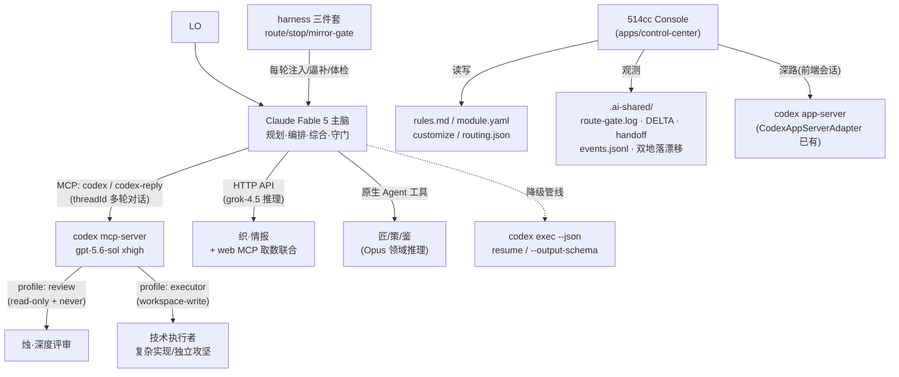

# v3.5 深度进化设计：对话式协作 + 模型优势路由 + 全配置前端

> 状态：已评审落地（v3.5.0）
> 日期：2026-07-17
> 依据：8 路并行调研（AionUI / LiveAgent / pi / codeg / Codex 桌面端 / 多 agent 格局 / grok 生态 / 本地盘点，~97 万 token）+ 本地端到端实测
> 触发：LO 六点要求——①Claude↔Codex 深度对话协作 ②深度自定义 ③全配置前端界面 ④参考 AionUI/codeg/LiveAgent/pi/Codex 桌面端 ⑤参考多 agent 协作体系 ⑥按模型优势派活（grok 快+搜索强）

---

## 〇、一页纸结论

| 目标 | 决策 | 依据 |
|------|------|------|
| Claude↔Codex 对话 | **MCP 挂载为主路**（`codex mcp-server` → `codex`/`codex-reply` 双工具，threadId 跨轮记忆），app-server 为前端深路，`exec resume` 为降级管线 | 本地 0.144.1 端到端实测通过（PONG-1/PONG-2 跨轮记忆确认）；AionUI/codeg 走 ACP 需引入 npm SDK 自建 client，MCP 零新依赖且离 Claude Code 最近 |
| Codex 角色扩展 | 烛保留评审本职，**新增 Codex 技术执行者角色**（executor profile，workspace-write），按任务路由 | LO 明确要求"codex 作为技术"；Codex 侧双 profile = 同一二进制按角色切人格 |
| 模型优势路由 | rules.md §三 路由表 v2：Fable 5=主脑规划综合；Codex gpt-5.6-sol xhigh=深评审+技术攻坚；grok-4.5=快搜索/情报/长文档 | grok-4.5（2026-07-08 发布，$2/$6，500k ctx）；反代丢 server-side 搜索→织的"grok+web MCP 联合"是唯一正确姿势（调研证实现状设计） |
| 全配置前端 | **盘活 `apps/control-center/`**（已有 4100 行 + 46/47 测试通过），不从零造 | 本地盘点发现它已是目标的 60-70%：CodexAppServerAdapter 真多轮、五维路由评分、config validate/plan/apply/rollback 管线；缺的是治理账 + 与体系合一 |
| 多 agent 机制 | 吸收 LiveAgent/AionUI 的通信与隔离机制（roster 稳定 id、消息总线、worktree 隔离），**保留 514cc 异构路由大脑** | LiveAgent subagent 是单模型同构、AionUI 路由靠手选——异构自动路由是 514cc 反向优势 |

**明确不做**：可视化 agent 编排器（OpenAI 可视化 Agent Builder 上线 8 个月即退役，官方建议回归代码优先——Console 定位=配置+观测+审批面，编排留给主脑）。

---

## 一、调研关键事实（带出处）

### 1.1 Codex 集成面（四层，全部本地可用）

- `codex mcp-server`：暴露 `codex`（开会话，参数含 approval-policy/base-instructions/developer-instructions/model/sandbox/cwd）+ `codex-reply`（threadId/conversationId + prompt 续聊）。**threadId 经 `structuredContent.threadId` 返回**——SKILL 必须显式从这里取，不能只看 content 文本。〔本地实测 2026-07-17〕
- `codex exec`：`--json` JSONL 事件流、`--output-schema` 强类型输出、`resume <SESSION_ID|--last>` 多段续接。〔`codex exec --help` 实测〕
- `codex app-server`：官方全部 UI（桌面/VS Code/TUI）共用的双向 JSON-RPC 2.0（Thread/Turn/Item 三原语，stdio/unix/ws 三传输，`generate-ts`/`generate-json-schema` 可锁协议版本）。〔调研 codex-desktop 路〕
- profile 新格式：`$CODEX_HOME/<name>.config.toml` 独立文件叠加（`-p <name>`），非旧版 `[profiles.x]` 嵌套。〔`codex exec --help`〕

### 1.2 grok 生态（2026-07 现状）

- 现役阵容：grok-4.5（旗舰，coding+agentic，$2/$6/M，500k ctx，2026-07-08 发布）/ grok-4.3（1M ctx）/ grok-4.20-0309 三变体（multi-agent 专用）/ grok-build-0.1（廉价 agentic 编码）。
- **老 Live Search（search_parameters）已 410 Gone**；实时搜索唯一通道 = Agent Tools API（server-side web_search/x_search/code_execution），挂 xAI 原生 SDK 与 `/v1/responses`——**走 514claude.xyz 这类 OpenAI 兼容 chat-completions 反代基本全丢**。织当前 = 裸模型无实时搜索，"grok 推理 + web MCP 取数联合"是正确姿势（grok-researcher SKILL.md 现状设计被证实）。
- xAI 官方 CLI **Grok Build**（2026-05-25 beta，Rust 开源 ~12K 星）：支持 AGENTS.md/skills/hooks/MCP/subagents/ACP/headless JSON——够格当第三个本地 CLI agent。**本地未装，列为可选扩展**（见 §六 roadmap），不擅自引入。

### 1.3 外部参考工具的可移植模式

| 来源 | 模式 | 514cc 落点 |
|------|------|-----------|
| LiveAgent | pull-based 消息总线（bus.jsonl，direct/shared/decision/question 四通道，turn-boundary 有界快照注入） | roadmap P2：升级 handoff 单向文件流为双向轻量对话 |
| LiveAgent | 稳定 agent id + roster + 默认 resume 私有上下文 | **本轮落地**：`.ai-shared/roster.json` + handoff frontmatter 记 threadId |
| LiveAgent | worktree 隔离 + apply_policy 白名单（危险操作从纪律降为文件系统硬约束） | roadmap P2：Codex executor 写码任务包 worktree 壳 |
| AionUI | headless core + 薄前端（业务逻辑出 Electron 壳，浏览器直用） | 证实 control-center 现有形态正确（127.0.0.1+token+SSE） |
| AionUI | 存活探针三态（needs_auth/offline/missing）+ 协议自动识别 + 非破坏刷新 | roadmap P1：Console 健康面板 |
| AionUI/codeg | Mailbox+TaskManager+本地 Team MCP server 暴露 team_* 工具 | roadmap P2：与 bus.jsonl 同期评估 |
| codeg | delegate_to_agent 委派（异步 task_id+长轮询+深度限制+取消级联） | 对话桥的委派语义参考 |
| pi | JSONL 会话树 + 跨 provider 上下文接力（thinking 降级/tool call ID 规范化） | 跨模型上下文转移工程清单参考 |
| 多 agent 格局 | MCP=纵向(agent↔工具)、A2A=横向(agent↔agent)已定局；claude-flow v3 可靠性存疑（证实既有降级判断） | 协议选型依据 |

### 1.4 本地盘点核心发现

`apps/control-center/`（2026-07-15 建）：CodexAppServerAdapter（app-server --stdio 真多轮 + 审批回调）、router 五维加权（capability/quality/speed/health/cost + independentPass 强制异构）、config-manager（乐观锁+备份+原子替换+parse readback+审计事件）、Web UI（127.0.0.1+ephemeral token+SSE）。实测 `npm test` 46/47 通过（唯一失败是 http-e2e 60s 超时，环境类）。**问题**：与烛/织 SKILL 流程平行、无 decisions.md 记录、未注册 module.yaml、`config/control-center/models.json` 漂移（gemini 仍 enabled，违反 D-2026-07-16-005）。

---

## 二、架构总图



---

## 三、决策 1：Claude↔Codex 对话桥（三层通道）

### 3.1 主路：MCP 挂载（本轮落地）

```powershell
claude mcp add --transport stdio --scope user codex-agent -- codex mcp-server
```

- 注册为用户级 MCP server（**重启 Claude Code 会话后生效**）。
- 调用协议（写入烛 SKILL.md 的 DL 模式）：
  1. 开会话：`codex` 工具，显式传 `approval-policy`/`sandbox`/`base-instructions`（评审=read-only+never；执行=workspace-write）+ `cwd`。
  2. **从 `structuredContent.threadId` 捕获会话 ID**，写入 handoff frontmatter + `.ai-shared/roster.json`。
  3. 多轮往返：`codex-reply(threadId, prompt)`——质询、追问、reflection 迭代全在同一会话，Codex 保留完整上下文不再冷启动。
- 协作循环（主脑↔技术）：规划(Fable) → 派工(codex 开会话) → 质询/澄清(codex-reply 往返) → 产物 → 复核(Fable) → 修订(codex-reply) → 收敛。这是 LO 要的"能够对话"，不是单发问答。

### 3.2 Codex 侧双 profile（本轮落地）

- `~/.codex/review.config.toml`：`sandbox_mode="read-only"` + `approval_policy="never"`——烛的评审人格（只看不动手，机械保证）。
- `~/.codex/executor.config.toml`：`sandbox_mode="workspace-write"`——技术执行者人格。
- CLI 路径用 `-p review` / `-p executor`；MCP 路径在 `codex` 工具参数里直接传 sandbox/approval-policy（等效）。

### 3.3 降级管线：exec resume（本轮写入 SKILL）

MCP 不可用（如 headless/会话未重启）时：`codex exec --json <prompt>` 首轮 → 从 JSONL 事件取 session id → `codex exec resume <id> <续问>`。PowerShell stdin 陷阱（`'' |`）仅适用此 CLI 路径；MCP 常驻进程路径不适用（宪法 §四 备注更新）。

### 3.4 深路：app-server（Console 前端专用，已存在）

control-center 的 CodexAppServerAdapter 继续作为前端会话驱动；不要求日常 SKILL 流程使用。协议实验性——升级 codex 版本时跑 `codex app-server generate-json-schema` 对比锁版。

### 3.5 会话持久化：roster.json（本轮落地）

`.ai-shared/roster.json`：`{ agents: { <code>: { name, lastThreadId, lastRunAt, lastTopic, transport } } }`。召唤烛/executor 第 N 轮时默认查 roster 续会话（LiveAgent 稳定 id+resume 模式）；跨会话失效则如实新开并更新。

---

## 四、决策 2：模型优势路由表 v2（rules.md §三 修订）

| 信号 | 路由 | 模型依据 | 级别 |
|------|------|----------|------|
| 非平凡代码评审 / 安全敏感 / 性能关键 / 上生产前 | 烛（MCP 对话桥·review） | gpt-5.6-sol xhigh：深推理评审，异构照盲区 | 🔴 |
| **复杂技术实现 / 独立模块攻坚 / 大 diff 重构** | **Codex 技术执行者（MCP 对话桥·executor）** | 同上：技术执行力 + 沙箱隔离 | 🟡 |
| 实时事实 / 快搜索 / 竞品 / 文档>30KB 摘读 | 织（grok-4.5 + web MCP 联合） | 快 + 500k ctx + $2/$6 便宜 | 🔴 |
| 超长文档（>300KB）| 织（grok-4.3 1M ctx 档，customize 可切） | 1M 上下文 | 🟡 |
| MCU/RTOS/总线/驱动 诊断 | 匠（Opus） | 领域推理 | 🟡 |
| 新功能 / 空白页 / 复杂拆解 | 策（Opus） | 规格化推理 | 🟡 |
| 体系自评 | 鉴（Opus 只读） | 语义审计 | 🟡 |
| 规划 / 编排 / 综合 / 写作 / 最终判断 | 主驾 Fable 5 | 主脑不外包 | ⚪ |

原则不变：🔴 不许因"我自己也能答"跳过；⚪ 隐形档禁止过度调度；发火后 DELTA 可见。

---

## 五、决策 3：Console = 盘活 control-center

### 5.1 本轮落地（接电四件）

1. 修 `config/control-center/models.json` gemini 漂移（D-2026-07-16-005 对齐：gemini disabled，grok 表示为外部情报 provider）。
2. `module.yaml` 注册 control-center（apps 层新条目）+ CLAUDE.md 文件结构表补 `apps/`。
3. `decisions.md` 补治理账（它动过全局配置面却无 dogfood 记录——不重蹈 v3.4.1 诚实债）。
4. 本设计文档 + 烛评审记录（handoff + DELTA）。

### 5.2 P1 扩展（下一轮，已规划未实施）

- sources.json 扩配置面：三层 customize TOML（顺带实现机械合并器）、外置路由信号表（见 5.3）、output-style 切换、rules/人格双地落状态。
- 仪表盘直连现有数据源（零新造）：route-gate.log（TSV5 列）、`^__DELTA__:` 账本、handoff FIRE_PREFIXES、mirror-gate.log、events.jsonl、sync-runtime.ps1 -Check 漂移面板。
- AionUI 式存活探针三态健康面板（当前实测：serena/github/browserwing 三个 MCP 失联——首批展示数据）。
- summoned 审计闭环：route-gate.log 的 `summoned='?'` 占位列用 events.jsonl run 事件 / handoff 落盘时间对账回填。

### 5.3 路由合一（P1）

route-gate.py 硬编码的 RED/DIV/META 正则外置为数据文件，与 control-center routing.json 统一为单一路由真相源——hook 注入与前端可视化编辑读同一份。（治理代码改动，届时按契约驱动范式 + 烛评审。）

---

## 六、Roadmap（P2+，视 LO 优先级）

1. **bus.jsonl 消息总线**（LiveAgent 四通道模式）：轻量对话不再为一句话落一个 handoff 文件；handoff 保留承载重产物。channel=question 给"烛反问主驾"留回路。
2. **worktree 隔离 + apply_policy**：executor 写码任务在独立 worktree，主驾按 glob 白名单审 diff 后 apply——危险操作管控从纪律降为机械结构。
3. **Grok Build CLI 引入评估**（需 LO 拍板装新 CLI）：装后织获得本地 agentic 形态（subagents/hooks/MCP），control-center grok adapter 解禁。
4. **Team MCP server**（AionUI Mailbox+TaskManager 三件套）：与 bus.jsonl 同期评估，避免重复建设。
5. **Codex 侧 notify/hooks 对齐**：agent-turn-complete 触发写 handoff/DELTA，把"发火后价值可见"在 Codex 侧也焊成机械扳机。
6. **统一报告 schema**：烛的四节结构推广到织/匠/策（Result/Evidence/Risks），stop-gate 机械校验报告完整性。

---

## 七、风险与边界

- **MCP 挂载需重启会话生效**——本轮注册后由 LO 重启；重启前对话桥用 exec resume 降级路径同样可用。
- **codex mcp-server 工具的审批语义**：evaluation 用 `approval-policy=never` + 沙箱兜底（review=read-only 物理只读；executor=workspace-write 限工作区）。危险操作二次确认仍由主驾在派工前守（宪法 §二 不变）。
- **app-server 协议实验性**：仅 Console 深路使用，锁 schema 防漂移。
- **反代能力边界如实**：织无 server-side 实时搜索（410 Gone + 反代丢失），必须 web MCP 联合——SKILL.md 已如实标注，不假装有。
- **grok-4.20 multi-agent 变体 / cloud exec**：调研有记录但未本地验证，不写入路由表，不声称可用。
